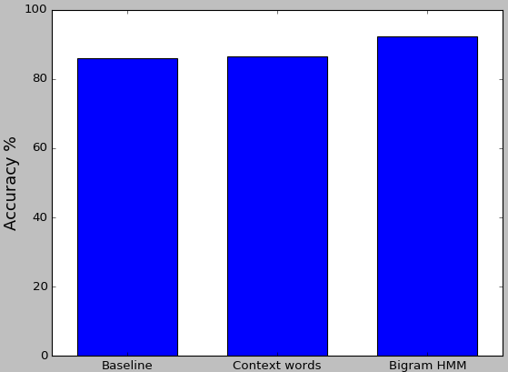

# Context Sensitive Spelling Corrector
- Text Pre-processing
- Most Common Confusing Word as Baseline
- Context Word Method
- Collocations Method: Bigram Hidden Markov Model
- Viterbi Algorithm
- Accuracy

Context sensitive spelling correction is the process of detecting and providing spelling suggestions considering the linguistic contexts for incorrectly spelled words in a text. In this project, I have implemented two methodologies to solve this problem: context word and collocations. The methods are trained and tested with data from the Penn Treebank corpus. The methods have been evaluated in terms of accuracy of correct word predictions.
I ran the code several times, and I found the baseline accuracy to be between 85 and 86 %, the context words accuracy to be between 86 and 87 %, which is a little more or sometimes nearly same as baseline accuracy, and the collocation accuracy to be 92 to 93 %, which is better than other methods every time.
In the future work, more relevant confusing words set according to the corpus should be used. In addition, other techniques should be implemented and their results must be compared to find the better context-sensitive spelling corrector.

